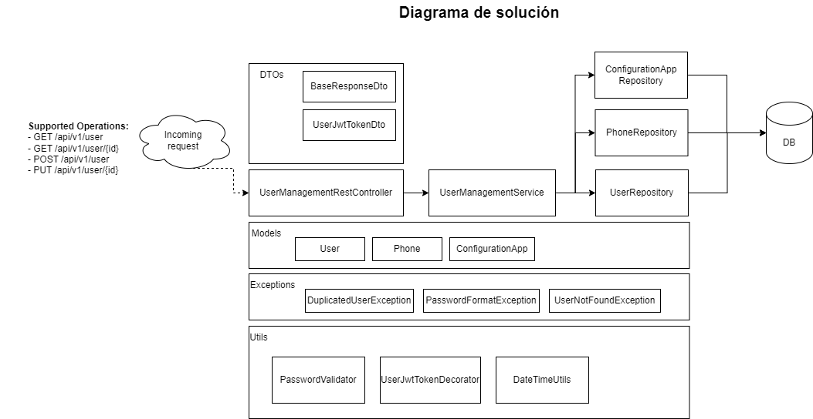

# User Management System

Este proyecto, denominado User Management System, tiene como objetivo proporcionar un sistema robusto para la gestión de usuarios, incluyendo operaciones como la obtención de usuarios existentes, creación y actualización de nuevos usuarios y búsqueda de usuarios por identificación.

## Diagrama de solución

## Arquitectura

El proyecto sigue una arquitectura evolutiva n-layer. La arquitectura se basa en servicios REST mediante el uso de tecnología Java y SpringBoot, aprovechando su marco de desarrollo para crear aplicaciones Java basadas en el principio de convención sobre configuración. La arquitectura permite una clara separación de responsabilidades entre los controladores REST, servicios de negocio y repositorios de datos.

## Compilación y ejecución del Proyecto

Para ejecutar el proyecto, sigue estos pasos:

1. Asegúrate de tener instalado Java 17 y Maven 3.8.4 en tu máquina.

2. Clona este repositorio a tu máquina local:

3.  Navega al directorio del proyecto:

   ``cd usermanagement``

4. Compila, ejecuta pruebas unitarias y crea el jar ejecutable de Spring Boot:

   ``mvn clean install``

5. Ejecuta la aplicación Spring Boot:

   ``cd target``
   
   ``java -jar usermanagement-0.0.1-SNAPSHOT.jar``

## Patrones de Diseño Utilizados

- **Patrón Repository**: Se emplea en los repositorios `PhoneRepository`, `UserRepository` y `ConfigurationAppRepository` para facilitar la interacción con la capa de persistencia, abstractizando el acceso a datos.

- **Patrón DTO (Data Transfer Object)**: La representación de los datos en las interfaces de controlador y servicios sigue un modelo de DTO, garantizando una separación adecuada entre la capa de presentación y la capa de negocio.

- **Patrón MVC (Model View Controller)**: Implementado mediante Spring Web, la vista vienen siendo los JSON de entrada y salida, los controllers son los RESTController y el model es de la capa service hacia abajo.

## Principios SOLID Utilizados

Se siguieron los principios SOLID, que son los mas utilizados en proyectos que conllevan programación orientada a objetos.

- **Principio de Responsabilidad Única (SRP)**: Cada clase tiene una única razón para cambiar, enfocándose en una responsabilidad específica. Por ejemplo, los repositorios se centran en el acceso a datos, mientras que los servicios gestionan la lógica de negocio.

- **Principio de Abierto/Cerrado (OCP)**: El sistema está diseñado para ser extensible sin modificar su código fuente existente. Por ejemplo, nuevas funcionalidades pueden agregarse fácilmente mediante la introducción de nuevos controladores y servicios.

- **Principio de Segregación de interfaces (IS)**: En el código proporcionado, se aplica segregación de interfaces en los repositorios `UserRepository` y `PhoneRepository`, que extienden la interfaz JpaRepository. Este principio SOLID sugiere que una clase no debería estar obligada a implementar interfaces que no utiliza. En este caso, las interfaces JpaRepository proporcionan métodos comunes para operaciones de persistencia, y cada repositorio puede utilizar solo los métodos relevantes.

- **Principio de Inyección de dependencias (DI)**: La inyección de dependencias está presente en el proyecto, y se emplea a través de Spring Framework. El uso de las anotaciones `@Autowired` en los campos `UserRepository` y `PhoneRepository` en la clase `UserManagementServiceImpl` ejemplifica la inyección de dependencias. Esta técnica permite que las dependencias sean proporcionadas por el contenedor de Spring, lo que facilita la gestión de componentes y sus dependencias.

## Patrones de Diseño GoF Utilizados

- **Patrón Observer**: Aunque no se encuentra explícitamente en el código proporcionado, el principio de inversión de dependencias (DIP) está presente, que es la base del patrón Observer. La capa de servicio depende de abstracciones, no de implementaciones concretas.

- **Patrón Builder**: La creación de instancias complejas, como el `Jwt`, podría beneficiarse de un patrón Builder para simplificar el proceso de construcción,
 tal como se muestra en la clase `JwtTokenProviderServiceImpl` haciendo uso de un builder para construir el token jwt.

- **Patrón Singletón**: Aunque no se encuentra explícitamente en el código proporcionado, el patrón Singleton está presente ya que Spring por default crea una sola instancia de los beans para servir a todas las peticiones.

- **Patrón Decorator**: Implementado en la interfaz UserJwtTokenDecorator, el patrón Decorator permite añadirle un token jwt de seguridad a un usuario creado o actualizado sin modificar el model original de User.

## Buenas Prácticas de Codificación

- **Manejo de Excepciones**: Se implementa un manejo adecuado de excepciones en el servicio `UserManagementServiceImpl`, proporcionando mensajes de error claros y específicos para diferentes situaciones.

- **Uso de Optional**: Se utiliza la clase `Optional` de Java en el servicio `UserManagementServiceImpl`, siguiendo las mejores prácticas para trabajar con resultados que pueden ser nulos.

- **Uso de Java Stream API**: Se emplea la API de streaming de Java para operaciones de filtrado y mapeo de colecciones.

- **Manejo Declarativo de Transacciones**: La anotación `@Transactional` se utiliza para definir declarativamente las transacciones, simplificando la gestión manual de transacciones.

- **Modularización y Separación de Responsabilidades**: La lógica de creación de usuario se encuentra en un servicio (`UserManagementServiceImpl`), separando las responsabilidades de la capa de controlador.

- **Manejo de Nulos con `Optional`**: `Optional` se utiliza para manejar casos donde `saved.getPhones()` puede ser nulo, evitando posibles excepciones `NullPointerException`.

- **Métodos de Referencia y `peek`**: Se emplean métodos de referencia (`phoneRepository::save`) y la operación `peek` en el stream para mejorar la legibilidad del código.

- **Generación de logs**: Se generan log usermanagement.log donde se muestran las operaciones y eventos mas importantes del API.

## Pruebas Unitarias Propuestas

Se han diseñado pruebas unitarias utilizando el marco de pruebas JUnit y herramientas de prueba de Spring. Estas pruebas cubren los siguientes casos:

- **El testGetUsers** Verifica que se devuelvan correctamente los registros precargados en la BD, evaluando que el código http de respuesta sea un 200 y que los nombres de los usuarios correspondan a los que se cargaron desde el script.

- **El testWrongRequest** Verifica que se devuelva un error 400 cuando el cuerpo de la petición para la creación de un usuario sea incorrecta.

- **El testCreateUser** Verifica que la creación de un usuario sea exitosa, evaluando que el código http de respuesta sea un 201, y que el nombre y teléfono correspondan al enviado en la petición.

- **El testCreateUserExistingEmail** Verifica que no se permita la creación de un usuario con correo electrónico que ya sea utilizado por otro usuario, evaluando que el código http de respuesta sea un 403.

- **El testCreateUserNoFormatPassword** Verifica que no se permita la creación de un usuario con un password que no cumpla con el formato de seguridad requerido, evaluando que el código http de respuesta sea un 403.

- **El testUpdateUser** Verifica que la actualización de un usuario sea exitosa, evaluando que el código http de respuesta sea un 200, y que el nombre y teléfono correspondan al enviado en la petición.

- **El testUpdateUserExistingEmail** Verifica que no se permita la actualización de un usuario con un correo electrónico que ya sea utilizado por otro usuario, evaluando que el código http de respuesta sea un 403.

- **El testUpdateUserNoFormatPassword** Verifica que no se permita la actualización de un usuario con un password que no cumpla con el formato de seguridad requerido, evaluando que el código http de respuesta sea un 403.

## Tecnologías Utilizadas

El proyecto se basa en las siguientes tecnologías:

- **JDK 17 **: JAVA Development Kit versión 17.

- **Spring Boot**: Marco de desarrollo para aplicaciones Java que facilita la creación de aplicaciones basadas en Spring con una configuración mínima.

- **Spring Data JPA**: Implementación de Spring para el acceso a datos basado en el estándar de Java Persistence API (JPA).

- **JUnit**: Marco de pruebas para la creación y ejecución de pruebas unitarias en Java.

- **MockMvc**: Marco de pruebas de Spring para realizar solicitudes HTTP simuladas y realizar aserciones sobre las respuestas.

- **H2 Database**: Sistema de gestión de bases de datos relacional en memoria para el desarrollo y pruebas. 

## Principios de Diseño API Restful

El proyecto sigue los principios de diseño API Restful, incluyendo:

La utilización de métodos HTTP estándar para realizar algunas de las operaciones, como:
- **Create**: Creación de usuarios.

- **Update**: Actualización de usuarios.

- **Get**: Consulta de usuarios.

Se emplea la respuesta HTTP adecuada para indicar el resultado de las operaciones.
- **Codigo 200**: Operación exitosa.
- **Codigo 201**: Usuario creado.
- **Codigo 403**: Operación no permitida (Usuario existente con correo proporcionado).
- **Codigo 500**: Error interno del servidor.

Se sigue los estándares de diseño de endpoints
- **Uso de versiónes de API**: Se utiliza versionamiento de APIs dentro de la URL, esto es util ya que podemos tener consumidores trabajando con diferentes versiones de la API sin afectar a los mas antiguos con las nuevas actualizaciones. 
    ``/api/**v1**/user``

- **Nombrado de recursos**: Se utiliza el estandar correcto en el nombrado de los recursos, se debe utilizar el nombre de la entidad y/o recurso que se va a estar administrando, en nuestro caso `user`.  
    ``/api/v1/**user**.``

Este sistema sigue los principios de REST, proporcionando una interfaz de programación web eficiente y fácil de consumir. 
- **Documentación de la API**: se genera automáticamente utilizando OpenAPI 3.0 (Antes swagger).
   - ``http://localhost:5050/swagger-ui/index.html``
   - ``http://localhost:5050/api-docs``

- **Uso de HATEOAS**: Te permite generar hypermedia links en la respuesta que le permite al cliente navegar dinamicamente hacia los recursos apropiados,
  en este caso se genera la URL del usuario creado en la operación POST de creación, se anexa en un header llamado location.

## Database

**Base de datos en memoria H2**: Mientras la aplicación se esta iniciando se ejecuta el script scheme.sql que contiene las sentencias DDL que crean la estructura de la base de datos y el script data.sql que contiene las sentencias DML para cargar algunos datos de ejemplo.

Tablas propuestas:

1.	USER =>  Almacena los usuarios del sistema.
2.	PHONE => Almacena los teléfonos relacionados al usuario.
3.	CONFIGURATIONAPP => Permite almacenar y modificar fácilmente las configuraciones generales de la App, como el **formato que debe cumplir el password**.

Si desea ver las estructuras de la tabla, los códigos estan localizados en la carpeta src/main/resources del código fuente.

## Testing REST APIs via Postman Client

**Obtener todos los usuarios**
HTTP Method: GET 
Request URL: http://localhost:5050/api/v1/user
 
**Obtener Usuario por ID REST API**
HTTP Method: GET 
Request URL: http://localhost:5050/api/v1/user/{id}
 
**Crear Usuario por ID REST API**
HTTP Method: POST 
Request URL: http://localhost:5050/api/v1/user/
 
Reglas de negocio aplicadas:
Si ya existe un usuario registrado con el mismo correo, el servicio retornara un error 403 indicando que ya existe un usuario con el correo proporcionado.

**Actualizar Usuario por ID REST API**
HTTP Method: PUT
Request URL: http://localhost:5050/api/v1/user/{id}
 
Reglas de negocio aplicadas:
Si ya existe un usuario registrado con el mismo correo, el servicio retornara un error 403 indicando que ya existe un usuario con el correo proporcionado.
Si ya existe un usuario registrado con el mismo correo, el servicio retornara un error 404 indicando que no existe un usuario con el id proporcionado.

**Postman collections: ** Importe el JSON ``UserManagement.postman_collection.json`` a su postman.
